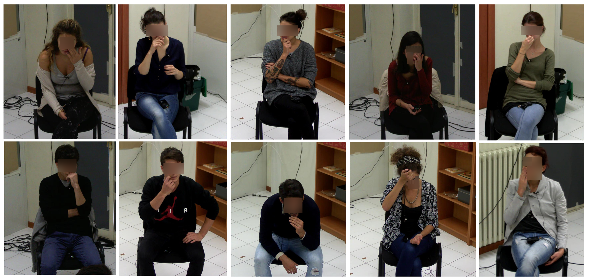

# Face-Touching-Behavior

This repository provides the face-touch annotations and the code introduced in our paper: 'Analysis of Face-Touching Behavior in Large Scale Social Interaction Dataset' accepted to be presented in [ACM ICMI 2020](http://icmi.acm.org/2020/).

Annotations are for the [dataset](https://pavis.iit.it/datasets/leadership-corpus) composed of audio-visual recordings of small group social interactions with a total number of 64 videos, each one lasting between 12 to 30 minutes and showing a single person while participating to four-people meetings. 
In total, 74K and 2M video frames were labelled as face-touch and no-face-touch, respectively.



The annotations can be downloaded by following the instructions given in [HERE](https://pavis.iit.it/datasets/leadership-corpus). While filling out the form provided, please specifically state 'Face-Touch Annotations' to be able to access them.

The annotations include:
* [ ] Face-touching behavior labels (1: face-touch, 0: no-face-touch) corresponding to all of the original video frames.
* [ ] Pose estimations, including face and hand key-points detection, obtained by applying [OpenPose](https://github.com/CMU-Perceptual-Computing-Lab/openpose) to all of the original video frames.
* [ ] The region of interests containing the face (the $x$ and $y$ coordinates of left-top corner of a bounding box, the width and height of it) calculated for all of the original video frames.
* [ ] The cross-validation splits used to test the methods mentioned below.

Given the dataset and the collected annotations, we applied the following methods for Face-Touch detection:
* [ ] Rule-based (corresponding files: ruleBasedMethod_main.m and convertjsonToMat.m)
* [ ] Hand-crafted features-based (corresponding files: XX.py)
* [ ] Feature learning-based (corresponding files: dataset.py, model.py, test.py, train.py and utils.py)

For any questions, feel free to contact cigdem.beyan@iit.it

## When using this dataset for your research, please cite the following paper in your publication:
```
Cigdem Beyan, Matteo Bustreo, Muhammad Shahid, Gian Luca Bailo, Nicolo Carissimi and A. Del Bue, 
"Analysis of Face-Touching Behavior in Large Scale Social Interaction Dataset," 
in Proceedings of 22nd ACM International Conference on Multimodal Interaction (ICMI), 2020.
```
```
@inproceedings{BeyanICMI2020,
author = {Cigdem Beyan and Matteo Bustreo and Muhammad Shahid and Gian Luca Bailo and Nicolo Carissimi and Alessio Del Bue},
title = {Analysis of Face-Touching Behavior in Large Scale Social Interaction Dataset},
year = {2020},
publisher = {ACM},
booktitle = {Proceedings of 22nd ACM International Conference on Multimodal Interaction (ICMI)},
}
```

## Disclaimer
The software is provided "as is", without warranty of any kind, express or implied, including but not limited to the warranties of merchantability, fitness for a particular purpose and noninfringement. In no event shall the authors, PAVIS or IIT be liable for any claim, damages or other liability, whether in an action of contract, tort or otherwise, arising from, out of or in connection with the software or the use or other dealings in the software.

## LICENSE
This project is licensed under the terms of the MIT license.
